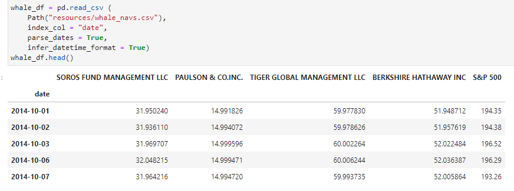
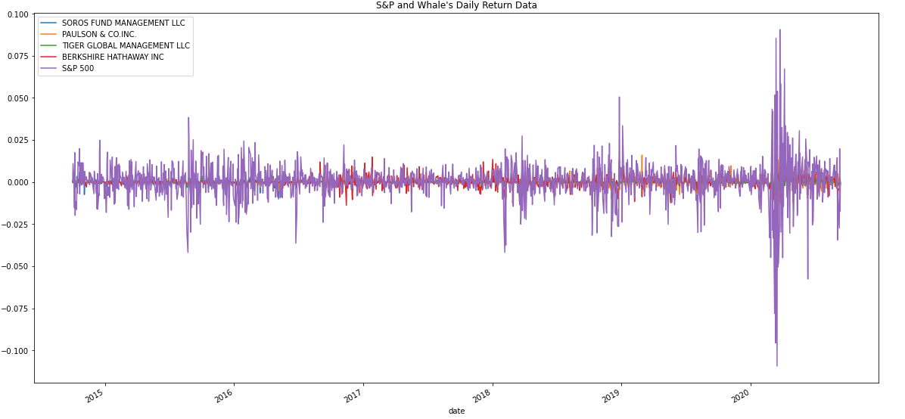
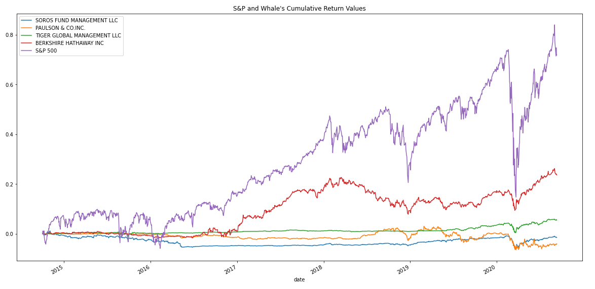
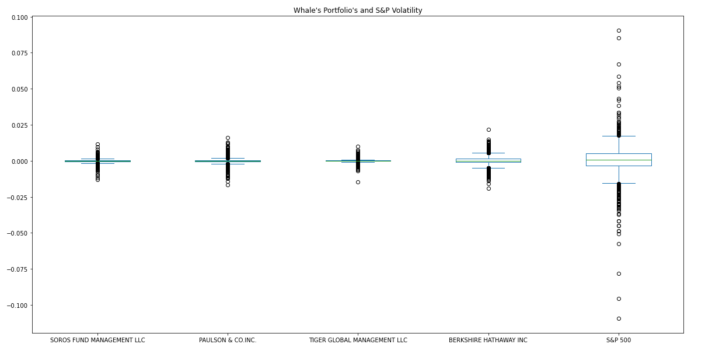
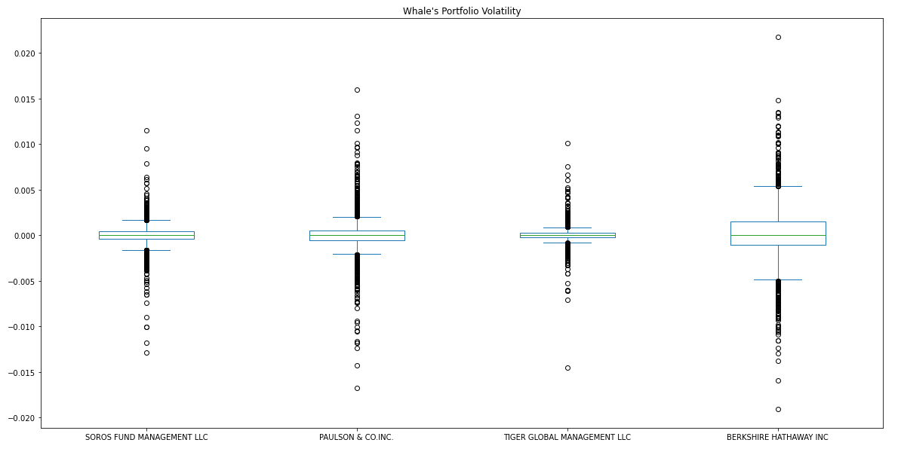
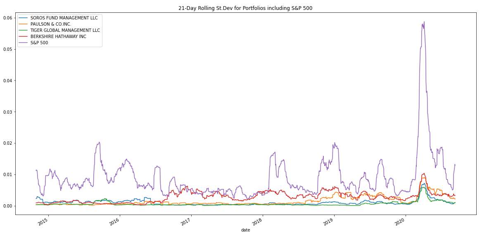
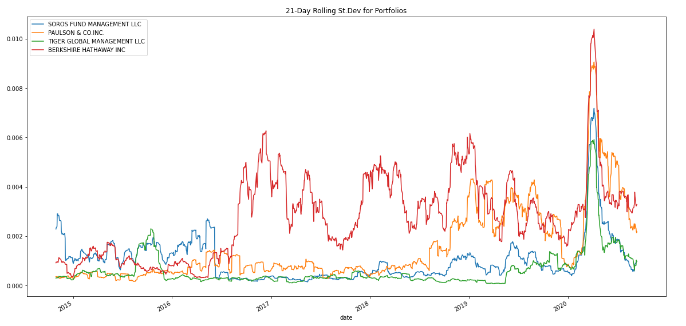
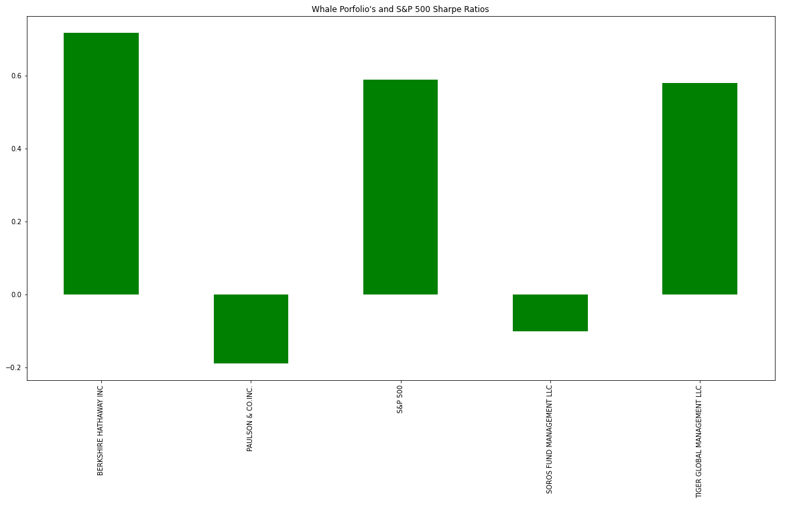
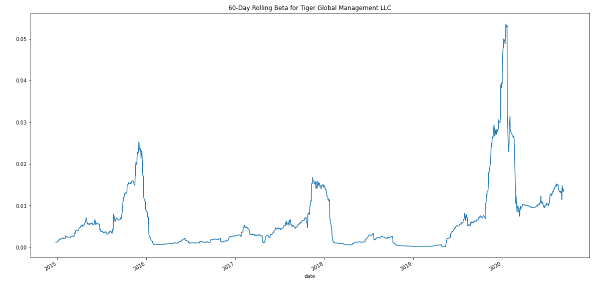
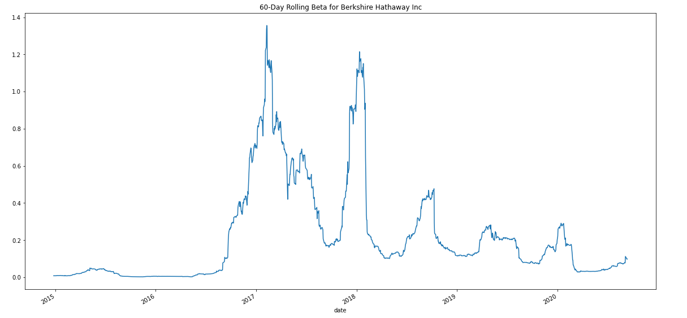

# risk_return_analysis
This project uses quantitative analysis to determine the most profitable risk-adjusted investment of four portfolios. 

The analysis utilizes variance, stardard deviation, Sharpe's Ratio, and beta to determine the optimal investment.

---
## Technologies
This program utilizes Jupyter Notebook in conjunction with the following libraries:

Pandas, Path from Pathlib, Numpy, and matplotlib.

---
## Installation Guide
None

---
## Usage
First the whale_navs.csv file is imported and we display the first 5 rows to verify it is correct.

The program then determines the daily return of each portfolio and graphs the data.

Then, the application will calculate and visualize the cumulative returns.

The program now uses the same daily return values but visualizes the data in a box plot. 

There are two graphs displaying this data, the second excludes the S&P 500 in order to more closely analyze the differences in daily return between the portfolios.

Then the application calculates and visualizes the 21-day rolling standard deviations for each portfolios and the S&P 500.

The second graph excludes the S&P 500 to help visualize data in a bit more detail.

Then the Sharpe Ratio of the portfolios and the S&P 500 is displayed as a bar graph.

The previous graph showed us that Berkshire Hathaway and Tiger Global Management are the two most promising portfolios.

The program now visualizes the beta of Berkshire Hathaway and Tiger Global Management in order to compare each portfolio's risk-to-reward profile.

---
## Contributors
Kevin Gross

---
## License
Mit License